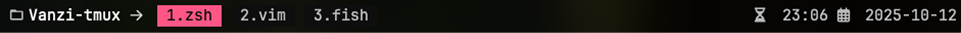

# 🌈 Vanzi Tmux Theme

**Vanzi Theme** is a clean and minimalist **tmux** theme featuring both **light** and **dark** variants, optional **transparency**, and an **active pane border highlight**.  
It’s designed for a modern and balanced look across terminals, whether opaque or with a blurred background.

---

## ✨ Features

- 🎨 Two color variants:
  - `ivory` → light theme  
  - `vanzi` → dark theme  
- 🧊 Optional background transparency  
- 🔲 Highlighted active pane border  
- 🪶 Minimal and elegant status bar  
- 🪟 Consistent colors for windows, panes, and messages  
- 🕒 Displays current time and date on the status bar  

---

## 📦 Installation

### Using [TPM (Tmux Plugin Manager)](https://github.com/tmux-plugins/tpm)

1. Open your tmux configuration file:
   ```bash
   nvim ~/.config/tmux/tmux.conf
   ```

2. Add the plugin line:
   ```bash
   set -g @plugin 'briantarqui/vanzi-tmux-theme'
   ```

3. Save and reload tmux:
   ```bash
   tmux source ~/.config/tmux/tmux.conf
   ```

4. Install the plugin inside tmux:
   ```bash
   prefix + I
   ```
   (Default `prefix` is `Ctrl + b`)

---

## ⚙️ Configuration

You can customize the theme through the following tmux options:

| Option | Possible Values | Description |
|--------|------------------|-------------|
| `@theme_variant` | `ivory` \| `vanzi` | Select light or dark variant |
| `@bg_transparency` | `on` \| `off` | Enable or disable transparent background |
| `@active_border` | `on` \| `off` | Enable a highlighted border on the active pane |

### 🧩 Example Configuration

```bash
set -g @plugin 'briantarqui/vanzi-tmux-theme'

# Dark theme
set -g @theme_variant "vanzi"

# Transparent background (great with blurred terminals)
set -g @bg_transparency "on"

# Highlight the active pane border
set -g @active_border "on"

run-shell "~/.tmux/plugins/vanzi-tmux-theme/vanzi.tmux"
```

---

## 🪄 Quick Reload

If you make any configuration changes, reload tmux without restarting:

```bash
tmux source ~/.config/tmux/tmux.conf
```

---

## 🧠 Internal Variables

| Variable | Description |
|-----------|-------------|
| `c_base`, `c_base_v` | Base background colors |
| `c_text_l`, `c_text_m`, `c_text_h` | Text contrast levels |
| `c_punk_main`, `c_punk_v` | Accent colors |
| `c_border_l`, `c_border_m`, `c_border_h` | Border color levels |

---

## 🧩 Repository Structure

```
vanzi-tmux-theme/
├── vanzi.tmux       # Main theme script
├── README.md     # English documentation
```

---

## 🖼️ Preview

> - Vanzi (dark theme)
>
>   

> - Ivory (light theme)
>
>   
---

## 🧑‍💻 Author

**Brian Tarqui**  
Designer and developer of minimalist tools and tmux themes.  
🌐 [github.com/briantarqui](https://github.com/briantarqui)

